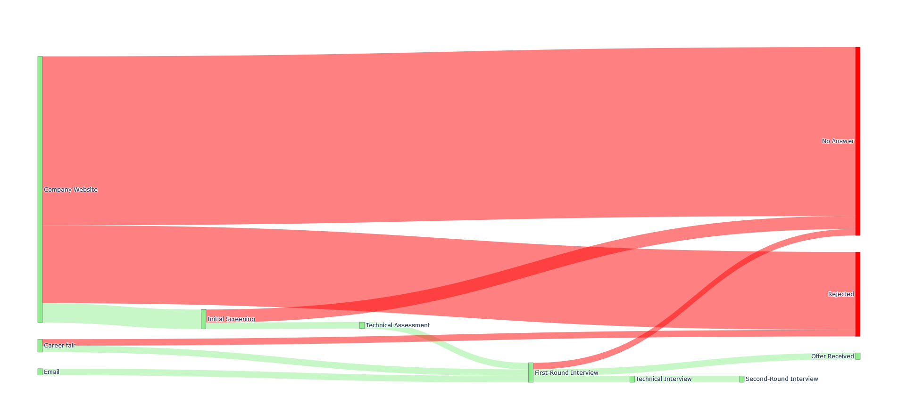

# SankeyApplications

This repository offers a unique approach to visualizing the journey of job and internship applications through various interview stages using Sankey diagrams. Whether you’re navigating complex recruitment processes or analyzing trends in interview outcomes, this project provides tools to make sense of application flows at a glance.

## Features

- Visualize Application Stages: Track each step of the application process, from initial contact through interviews to the final outcome.
- Customizable Data Input: Input your data through JSON files for flexibility and ease of modification.
- Python-Powered Visualizations: Leverage popular libraries, including Plotly and Matplotlib, to generate interactive and static Sankey diagrams.
- Conda Environment: The project is set up using Conda/Miniconda for easy dependency management, ensuring a smooth setup process.

## Installation

1. Clone the Repository:

   ```bash
   git clone https://github.com/willfliaw/SankeyApplications.git
   cd SankeyApplications
   ```

2. Set Up the Conda Environment:

   You can create the environment from the provided `environment.yml` file:

   ```bash
   conda env create -f environment.yml
   ```

   Or, manually install the required packages:

   ```bash
   conda create -n sankey python matplotlib numpy plotly ipykernel
   ```

3. Activate the Environment:

   ```bash
   conda activate sankey
   ```

## Usage

Prepare your data in a JSON format specifying application sources, interview stages, and outcomes. Then, run the main script to generate Sankey diagrams based on this data:

```python
python main.py
```

You can customize the visualization style and layout directly in the script.

## Dependencies

This project requires the following libraries:

- Python (3.x)
- Plotly
- Matplotlib
- NumPy
- JSON (for data handling)

## Example

Here’s a sample Sankey diagram generated from a typical application process. Each stage is color-coded, showing the progression and filtering of applications through different stages.



## Contributions

Contributions and suggestions are welcome! Please open an issue or submit a pull request.
