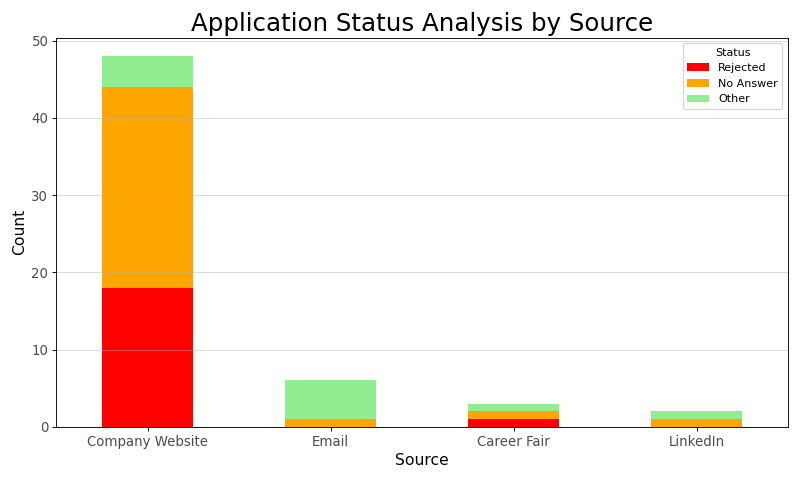
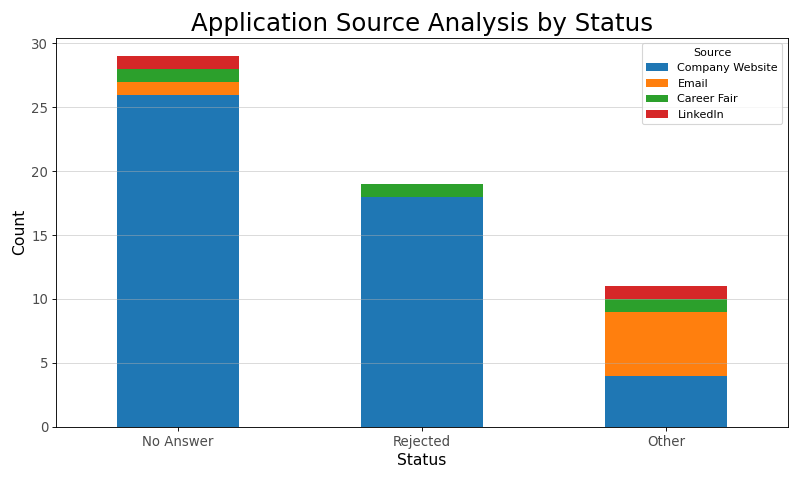

# ApplicationVisualizer

This repository provides a comprehensive suite of tools for visualizing application data through various stages and processes. Whether tracking job and internship applications, analyzing recruitment trends, or visualizing similar workflows, this project offers powerful and flexible visualization capabilities tailored to your data.

## Features

- Sankey Diagrams: Visualize the flow of applications through different stages, identifying key transitions and drop-off points.
<!-- - Bar and Line Charts: Compare application statistics over time, across sources, or between outcomes. -->
- Interactive Dashboards: Leverage Plotly to create dashboards that allow dynamic filtering and data exploration.
<!-- - Customizable Data Inputs: Use JSON or CSV formats to provide flexible input options for various data types. -->
- Python-Powered Visualizations: Utilize popular libraries, including Plotly, Matplotlib, and Pandas, for static and interactive data visualizations.
- Conda Environment: A ready-to-use Conda environment ensures easy installation and compatibility.

## Installation

Follow these steps to set up the environment and get started with the ApplicationVisualizer project:

### 1. Clone the Repository

Begin by cloning the repository to your local machine:

```bash
git clone https://github.com/willfliaw/ApplicationVisualizer.git
cd ApplicationVisualizer
```

### 2. Set Up the Conda Environment

To ensure all required dependencies are installed, use the provided `environment.yml` file to create a Conda environment:

```bash
conda env create -f environment.yml
```

Alternatively, you can manually install the required packages by creating an environment and installing the dependencies:

```bash
conda create -n appviz python ipykernel jupyter matplotlib numpy pandas plotly python-kaleido seaborn -c conda-forge
```

### 3. Activate the Environment

Activate the environment before running any scripts:

```bash
conda activate appviz
```

## Usage

To explore the capabilities of this repository, a Jupyter Notebook is provided, allowing for an interactive and user-friendly experience. Follow the steps below to get started:

### 1. Launch Jupyter Notebook

After activating the Conda environment, launch Jupyter Notebook from the command line:

```bash
jupyter notebook
```

This will open the Jupyter Notebook interface in your default web browser.

### 2. Open the Provided Notebook

Navigate to the repository's directory and open the provided notebook file, e.g., `ApplicationVisualizer.ipynb`.

### 3. Follow the Instructions in the Notebook

The notebook contains:

- Guidance on Data Preparation: Learn how to format your JSON or CSV data for use in the visualizations.
- Code Examples: Run cells to generate Sankey diagrams, bar charts, line charts, and more using your data.
- Interactive Exploration: Adjust parameters and experiment with different visualization settings directly in the notebook.

### 4. Example Workflow

1. Prepare your data file (e.g., `applications.json`).
2. Upload the file to the `data` directory.
3. Follow the steps in the notebook to visualize your data.

### 5. Sample Data

A sample dataset is provided in the `data` directory to help you get started quickly. Load the dataset and run the provided cells to generate example visualizations.

### Tips

- Save your notebook progress regularly to preserve your visualizations and notes.
- You can export the generated visualizations from the notebook to use in reports or presentations.

## Examples

### Sankey Diagram

Showcase the progression of applications through different stages.


### Bar Charts

#### Status Analysis by Source

Visualize the distribution of application statuses (e.g., Rejected, No Answer, Other) across different application sources.



#### Source Analysis by Status

Explore the contribution of each application source to different statuses in a stacked bar chart.




## Contributions

Contributions and suggestions are welcome! Feel free to:

- Open an issue for bug reports or feature requests.
- Submit a pull request with improvements or additional visualization scripts.

## Future Directions

- Expand support for new visualization types, such as heatmaps and scatter plots.
- Incorporate advanced database tools like MongoDB.
